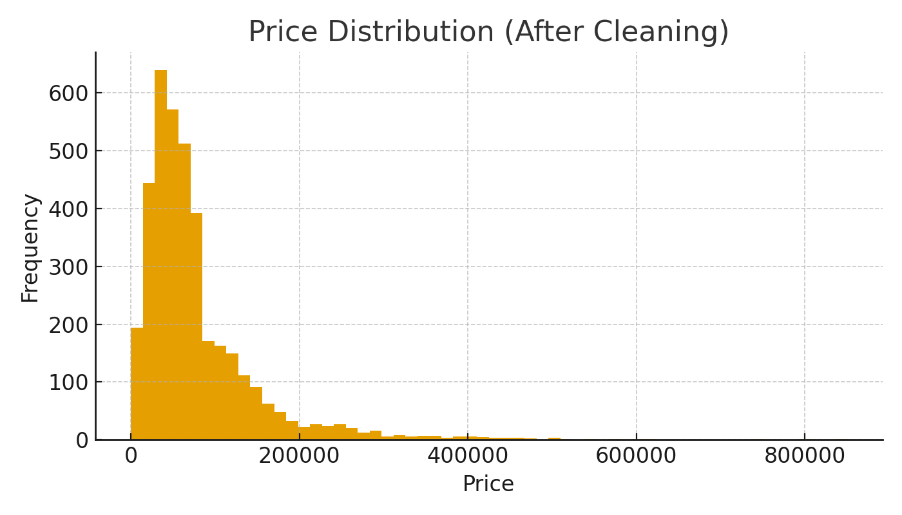
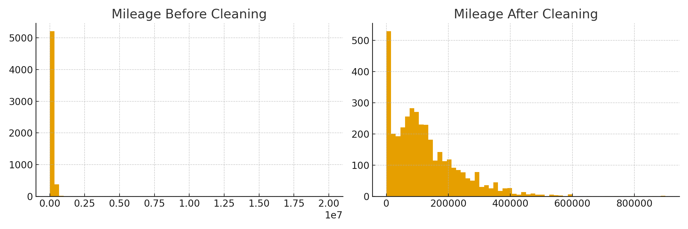
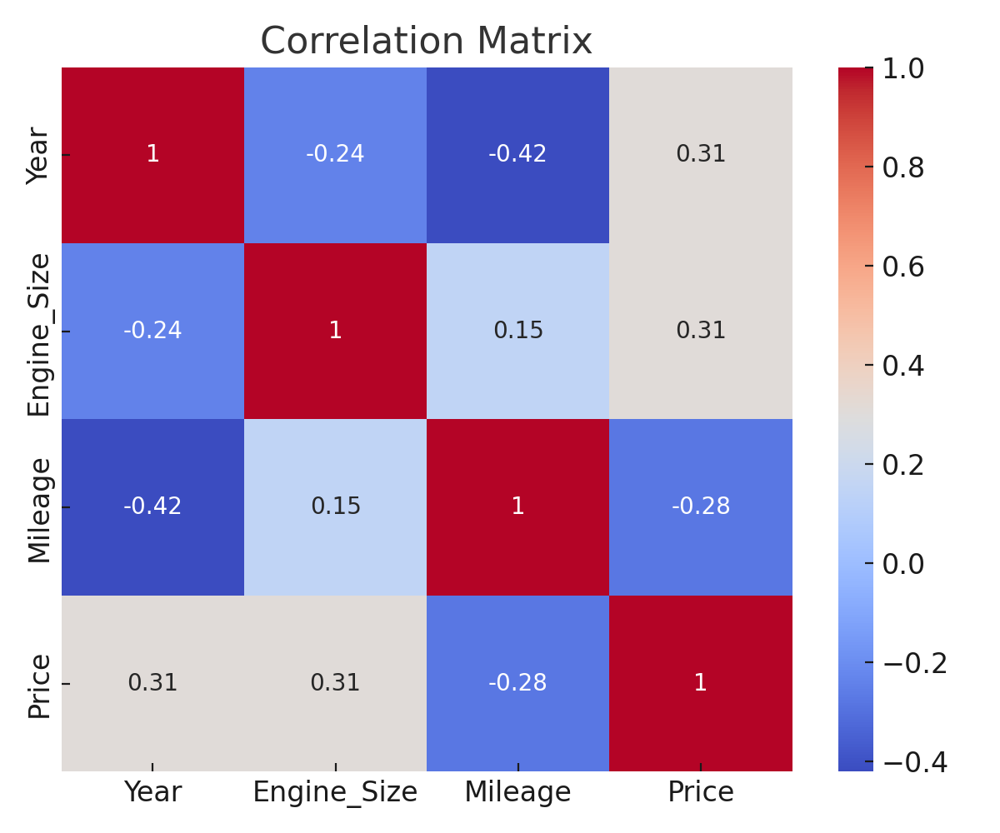
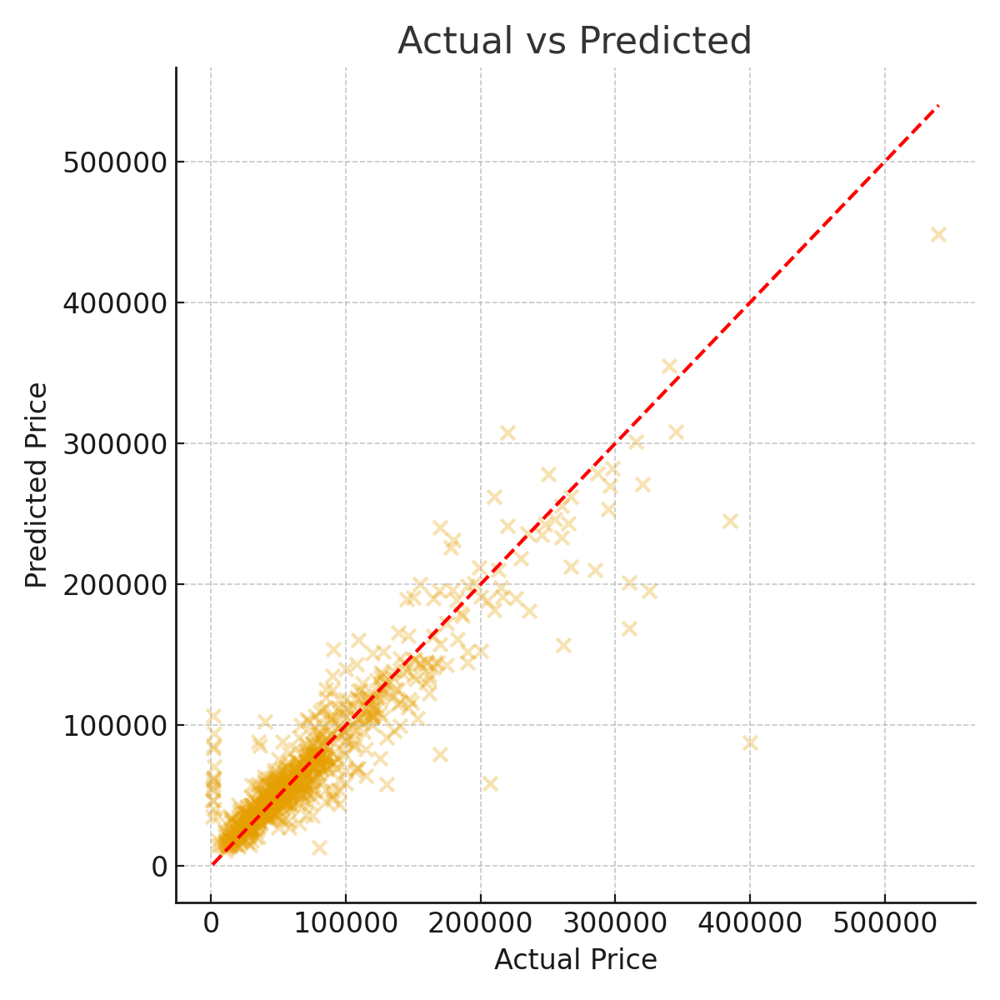
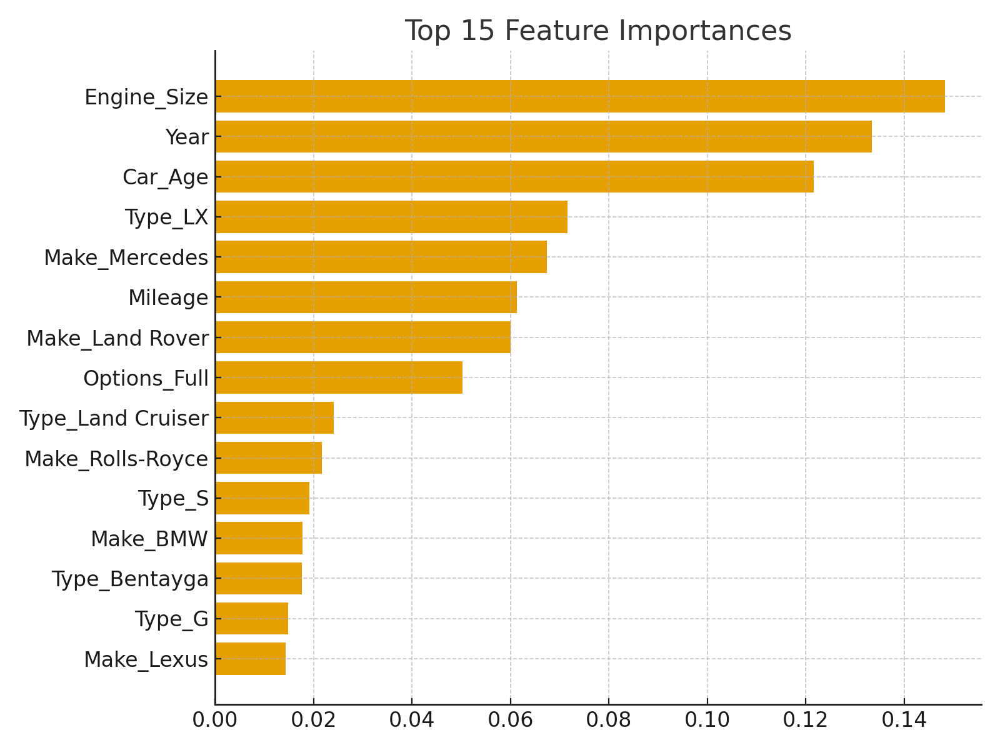

# 🚗 Saudi Arabia Used Cars Price Prediction  
**Capstone Project – Machine Learning (Module 3)**  

---

## 📌 Project Overview
This project builds a **Machine Learning regression model** to predict used car prices in Saudi Arabia using historical listing data.  
The goal is to help sellers price cars fairly, assist buyers in decision-making, and support marketplace business functions.

---

## 📊 Visualizations Included

### 1. Distribusi Harga (Price)


### 2. Distribusi Mileage Sebelum & Sesudah Cleaning


### 3. Korelasi Fitur Numerik


### 4. Actual vs Predicted Plot


### 5. Feature Importance (Top 15)


(*Tambahkan gambar-gambar ini ke folder `/assets` di GitHub repo Anda.*)

---

## 📂 Repository Structure
```
project-root/
│
├── Capstone_ML_SaudiUsedCars_full_explained_v2.ipynb
├── model_saudi_used_cars.pkl
├── README.md
│
└── assets/
    ├── price_distribution.png
    ├── mileage_comparison.png
    ├── corr_matrix.png
    ├── actual_vs_predicted.png
    └── feature_importance.png
```

---

## 🧠 Business Understanding

### 🎯 Problem Statement  
Marketplace mobil bekas di Arab Saudi sering mengalami harga yang tidak konsisten.  
Masalah utama:
- Seller menentukan harga berdasarkan intuisi  
- Banyak listing overpriced/underpriced  
- Buyer kesulitan menilai fairness harga  

### 🎯 Project Goal  
Membangun model ML yang:
- Memprediksi harga mobil bekas secara akurat  
- Mengidentifikasi faktor penentu harga  
- Mendukung price recommendation untuk marketplace  

---

## 📊 Dataset Summary

| Feature | Description |
|--------|-------------|
| Price | Target harga mobil |
| Year | Tahun produksi |
| Mileage | Jarak tempuh |
| Engine_Size | Kapasitas mesin |
| Make, Type, Region | Informasi kategori |
| Options | Level fitur |
| Negotiable | Bisa nego atau tidak |

Jumlah data setelah cleaning: **~5.600 baris**  
Missing value: **0 NaN**

---

## 🧼 Data Cleaning Steps
- Menghapus nilai harga tidak valid (`Price = 0`)  
- Menghapus outlier ekstrem (`Mileage > 1.000.000`)  
- Menghapus duplikat  
- Menambahkan fitur baru: `Car_Age`  

---

## 🔍 Exploratory Data Analysis (EDA)

Hasil penting:

- Harga sangat skewed sebelum cleaning  
- Brand premium → harga lebih tinggi  
- Mileage & Car_Age berbanding terbalik dengan Price  
- Engine size → berpengaruh positif terhadap Price  

---

## ⚙️ Modeling

### Baseline — Dummy Regressor
| Metric | Score |
|--------|--------|
| RMSE | 64,991 |
| MAE | 40,437 |
| R² | -0.072 |

### Final Model — Random Forest Regressor
| Metric | Score |
|--------|--------|
| RMSE | **25,419** |
| MAE | **13,879** |
| R² | **0.836** |

Model menjelaskan **83.6% variasi harga mobil bekas**.

---

## 📈 Evaluation Insights

### ✓ Actual vs Predicted  
Titik mendekati garis diagonal → prediksi akurat.

### ✓ Residual Distribution  
Residual tersebar di sekitar 0 → error acak, tidak bias.

### ✓ Feature Importance  
Fitur terpenting:
1. Car_Age  
2. Mileage  
3. Engine_Size  
4. Make  
5. Options  

---

## 🚀 Deployment
Model disimpan sebagai:
```
model_saudi_used_cars.pkl
```

Cara pakai:
```python
import joblib
model = joblib.load("model_saudi_used_cars.pkl")
model.predict(new_data)
```

---

## 📝 Business Recommendations

### 1. Price Recommendation Engine  
Berikan estimasi harga + range harga untuk seller.

### 2. Fair Price Indicator  
Label seperti:  
- Good Deal  
- Fair Price  
- Overpriced  

### 3. Seller Education  
Gunakan feature importance untuk menjelaskan faktor harga.

### 4. Market Segmentation  
Gunakan analisa harga per brand & region untuk strategi promosi.

---

## 🚀 Future Improvements
- Hyperparameter tuning  
- Tambah fitur kondisi mobil  
- Coba model XGBoost / CatBoost  
- Deploy API model  
- Data drift monitoring  

---

## 👤 Author
**Andi Rizki Nofentri**  
Data Analyst & Machine Learning Practitioner  
Capstone Project – Machine Learning Module 3  
